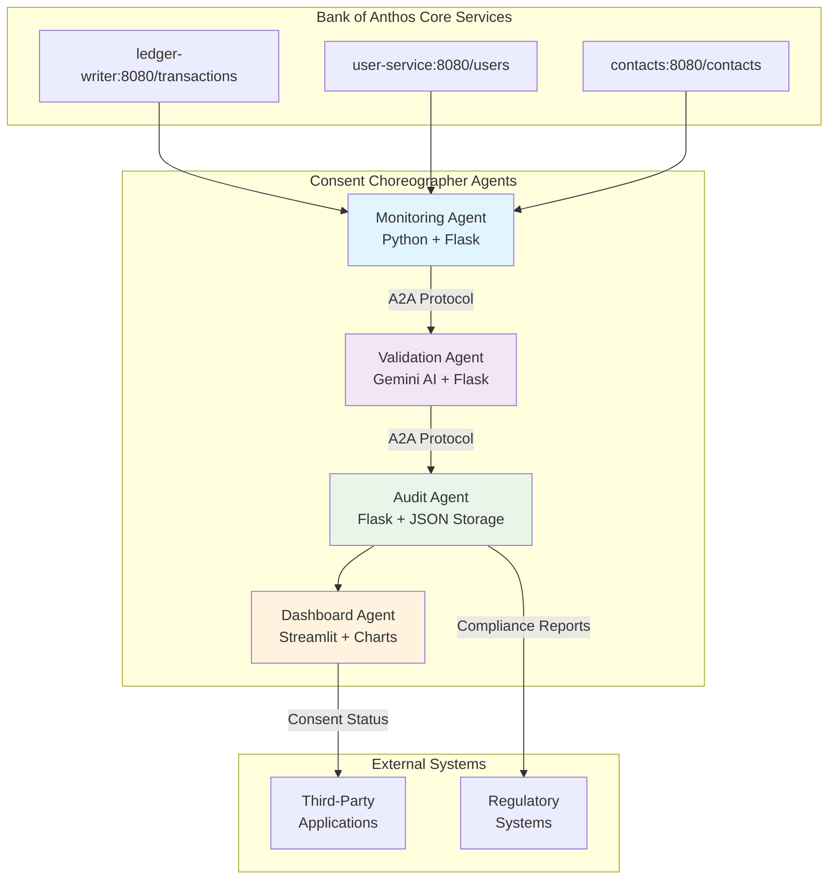
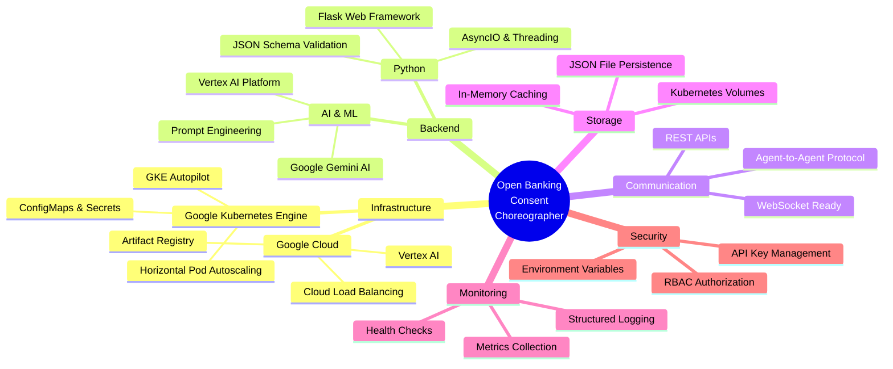
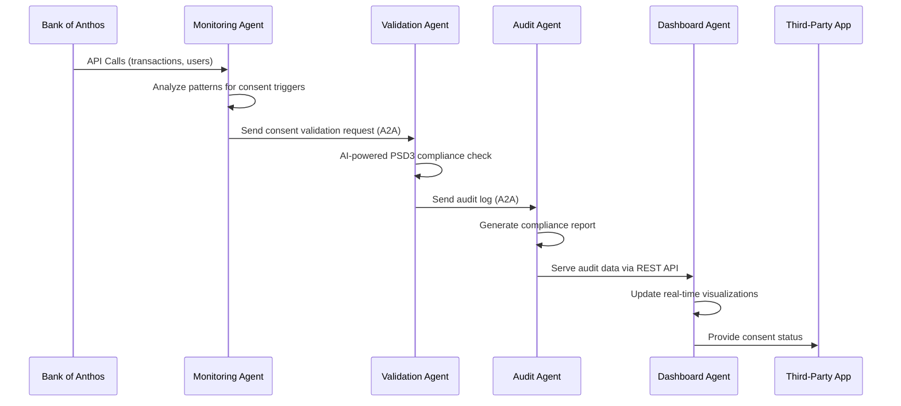
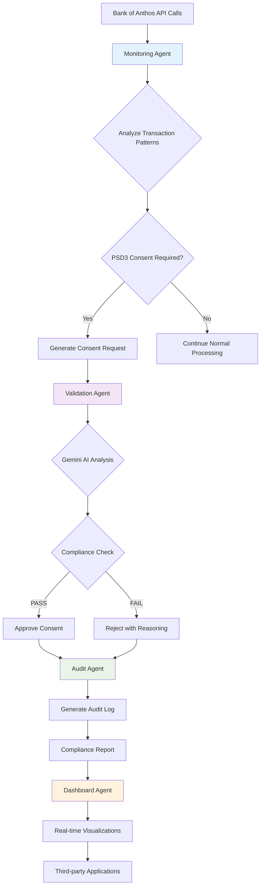

# Open Banking Consent Choreographer

🏦 **PSD3-Compliant Multi-Agent AI System for Automated Consent Management**

A sophisticated multi-agent AI system that provides automated PSD3 (Payment Services Directive 3) open banking consent management. The system uses advanced AI, microservices architecture, and agent-to-agent communication protocols to enable intelligent, compliant third-party data sharing while maintaining regulatory compliance.

## 🏗️ System Architecture



## 🛠️ Technology Stack



## 🤖 Multi-Agent Architecture



### Agent Components

#### 1. Monitoring Agent (`monitoring_agent.py`)
**Core Function**: Intelligent consent trigger detection
- **API Integration**: Polls Bank of Anthos services for activity patterns
- **Pattern Recognition**: Identifies high-value transactions, third-party access, account changes
- **Consent Triggers**: Generates structured consent requests based on PSD3 Article 64
- **Communication**: A2A protocol messaging to Validation Agent
- **Scalability**: Configurable polling intervals with backoff strategies

#### 2. Validation Agent (`validation_agent.py`)
**Core Function**: AI-powered regulatory compliance validation
- **Gemini AI Integration**: Leverages Google Vertex AI for sophisticated analysis
- **PSD3 Compliance Engine**: Validates against Articles 64, 65, 66, 67 requirements
- **Risk Assessment**: Multi-factor risk scoring with confidence metrics
- **Decision Logic**: Approve/Deny with detailed reasoning and remediation steps
- **Fallback System**: Rule-based validation when AI services unavailable
- **Audit Trail**: Comprehensive logging of all validation decisions

#### 3. Audit Agent (`audit_agent.py`)
**Core Function**: Regulatory compliance reporting and persistence
- **Compliance Tracking**: Continuous monitoring of PSD3 regulatory requirements
- **Audit Logging**: Structured JSON audit trails with full context
- **Report Generation**: Automated compliance reports with risk assessments
- **Data Persistence**: File-based storage with Kubernetes volume mounting
- **API Services**: REST endpoints for audit data access and reporting
- **Retention Policies**: Configurable log retention and archival strategies

#### 4. Dashboard Agent (`streamlit_agent.py`)
**Core Function**: Real-time operational intelligence and compliance monitoring
- **Interactive Visualizations**: Live charts showing consent processing metrics
- **Compliance Dashboards**: Real-time compliance status and risk indicators
- **Agent Health Monitoring**: System status and performance metrics
- **Audit Trail Viewer**: Detailed consent decision history with AI reasoning
- **Manual Testing Interface**: Direct consent trigger capabilities for testing
- **Export Capabilities**: Compliance reports and audit data export

## 🚀 Deployment

### Prerequisites
- Google Cloud Project with billing enabled
- `gcloud`, `docker`, `kubectl` CLI tools installed
- Google AI API access (Gemini)
- Authenticated with `gcloud auth login`

### Quick Deployment

```bash
cd agents/
cp .env.template .env
# Edit .env with your PROJECT_ID and GOOGLE_API_KEY
./deploy.sh
```

**The deployment script handles:**
1. ✅ Environment variable validation
2. ✅ YAML configuration substitution
3. 🚀 Kubernetes deployment with autoscaling
4. 🌐 Ingress configuration for dashboard access

### Data Flow Architecture



### Manual Deployment Steps

#### 1. Infrastructure Setup
```bash
# Configure Google Cloud
export PROJECT_ID="your-gcp-project-id"
gcloud config set project $PROJECT_ID

# Enable required APIs
gcloud services enable container.googleapis.com
gcloud services enable aiplatform.googleapis.com
gcloud services enable artifactregistry.googleapis.com

# Create GKE Autopilot cluster
gcloud container clusters create-auto consent-choreographer-cluster \
  --region=us-central1 \
  --release-channel=regular
```

#### 2. Build Images
```bash
# Authenticate Docker
gcloud auth configure-docker us-central1-docker.pkg.dev

# Build and push all images (replace YOUR_PROJECT_ID with your actual project)
docker build -f Dockerfile-monitoring -t us-central1-docker.pkg.dev/YOUR_PROJECT_ID/consent-agents/monitoring-agent:latest .
docker build -f Dockerfile-validation -t us-central1-docker.pkg.dev/YOUR_PROJECT_ID/consent-agents/validation-agent:latest .
docker build -f Dockerfile-audit -t us-central1-docker.pkg.dev/YOUR_PROJECT_ID/consent-agents/audit-agent:latest .
docker build -f Dockerfile-streamlit -t us-central1-docker.pkg.dev/YOUR_PROJECT_ID/consent-agents/streamlit-dashboard:latest .

# Push images
docker push us-central1-docker.pkg.dev/YOUR_PROJECT_ID/consent-agents/monitoring-agent:latest
docker push us-central1-docker.pkg.dev/YOUR_PROJECT_ID/consent-agents/validation-agent:latest
docker push us-central1-docker.pkg.dev/YOUR_PROJECT_ID/consent-agents/audit-agent:latest
docker push us-central1-docker.pkg.dev/YOUR_PROJECT_ID/consent-agents/streamlit-dashboard:latest
```

#### 3. Configure Environment
```bash
# Copy environment template and configure
cp .env.template .env
# Edit .env with your actual values (PROJECT_ID, GOOGLE_API_KEY, etc.)

# Alternative: Get Google AI API key (optional, can be done manually)
# ./setup_ai_key.sh  # This will help you get the API key
```

#### 4. Deploy Applications
```bash
# Get cluster credentials
gcloud container clusters get-credentials boa-consent-cluster --region=us-central1

# Deploy Bank of Anthos (from project root)
cd ..
kubectl apply -f kubernetes-manifests/

# Deploy agents using environment variables
cd agents/
./deploy.sh
```

#### 5. Access Dashboard
```bash
# Get dashboard URL
kubectl get ingress agents-ingress -n agents-ns

# Monitor agent logs
kubectl logs -f deployment/monitoring-agent -n agents-ns
kubectl logs -f deployment/validation-agent -n agents-ns
kubectl logs -f deployment/audit-agent -n agents-ns
```

## 🎯 Demo Instructions

### Key Demo Flows

#### Consent Trigger Detection
1. Monitoring Agent polls Bank of Anthos APIs
2. Detects "high-value transaction" trigger
3. Sends A2A message to Validation Agent

#### AI-Powered Validation
1. Validation Agent receives trigger
2. Uses Gemini to validate PSD3 compliance
3. Checks user consent preferences
4. Forwards to Audit Agent if valid

#### Compliance Reporting
1. Audit Agent logs all decisions
2. Generates compliance reports
3. Provides regulatory recommendations
4. Updates dashboard with real-time metrics

## 🔧 Configuration

### Environment Variables
```bash
# Required
PROJECT_ID=your-gcp-project-id
GOOGLE_API_KEY=your-gemini-api-key
GCP_LOCATION=us-central1

# Optional (with defaults)
MONITORING_INTERVAL=30
AUDIT_LOG_PATH=/tmp/audit_log.json
REPORT_INTERVAL_MINUTES=60
LOG_LEVEL=INFO
```

### Autoscaling Configuration
- **Monitoring Agent**: 1-3 replicas (CPU utilization > 50%)
- **Validation Agent**: 1-5 replicas (CPU utilization > 50%)
- **Audit Agent**: 1-3 replicas (CPU utilization > 50%)
- **Dashboard**: 1-3 replicas (CPU utilization > 50%)

## 📡 API Endpoints

### Monitoring Agent
```
POST /trigger-consent
Content-Type: application/json

{
  "type": "high_value_transaction",
  "amount": 25000,
  "purpose": "property_purchase",
  "third_party_provider": "RealEstateCo",
  "user_id": "user123"
}
```

### Audit Agent
```
GET /logs          # Retrieve audit logs
GET /health        # Health check
POST /audit        # Submit audit data
```

### Dashboard Agent
```
GET /             # Main dashboard interface
GET /health       # Health check
```

## 🛡️ Security & Compliance

### PSD3 Regulatory Compliance
- **Article 64**: Explicit consent requirements
- **Article 65**: Consent withdrawal mechanisms
- **Article 66**: Information obligations
- **Article 67**: Right to data portability

### Security Features
- **API Key Authentication**: Google AI services
- **Environment Variable Configuration**: No hardcoded secrets
- **RBAC Authorization**: Kubernetes service accounts
- **Network Policies**: Inter-agent communication security
- **Audit Logging**: Comprehensive decision tracking

### PSD3 Compliance Features
- **Article 65**: Explicit, revocable consent management
- **Article 66**: Third-party access controls
- **Article 67**: Regular consent reviews
- **Audit Trail**: Complete compliance logging
- **Data Minimization**: Purpose-limited data access

### GKE Security
- **RBAC**: Service accounts with minimal permissions
- **Network Policies**: Isolated agents namespace
- **Secrets Management**: Environment-based configuration
- **Autopilot**: Google-managed security updates

## 📊 Monitoring & Observability

### Agent Health Checks
```bash
# Check all agent pods
kubectl get pods -n agents-ns

# View agent logs
kubectl logs -f deployment/validation-agent -n agents-ns

# Check autoscaling
kubectl get hpa -n agents-ns
```

### Metrics Available
- Consent approval/rejection rates
- AI validation confidence scores
- Agent processing latency
- Compliance risk levels
- Third-party access patterns

## 🧪 Testing & Development

### Local Development Setup
```bash
# Clone repository
git clone <repository-url>
cd agents/

# Install dependencies
pip install -r requirements-validation.txt

# Run individual agents locally
python monitoring_agent.py  # In terminal 1
python validation_agent.py  # In terminal 2
python audit_agent.py       # In terminal 3
python streamlit_agent.py   # In terminal 4
```

### Integration Testing
```bash
# Test A2A communication
curl -X POST http://localhost:8080/trigger-consent \
  -H "Content-Type: application/json" \
  -d '{"type": "high_value_transaction", "amount": 15000}'

# Check audit logs
curl http://localhost:8081/logs
```

## 🤝 Contributing

### Architecture Extension Points
- **Additional Agents**: Extend the multi-agent system with specialized compliance agents
- **Regulatory Frameworks**: Add support for additional regulations (GDPR, CCPA, etc.)
- **AI Models**: Integrate alternative AI providers or custom models
- **Data Sources**: Connect to additional banking APIs and data streams

### Development Guidelines
- **Code Style**: PEP 8 compliance with type hints
- **Testing**: Unit tests for agent logic and API endpoints
- **Documentation**: Update README for new features and configurations
- **Security**: Follow security best practices for API keys and data handling

## 📄 License

This project is part of the Bank of Anthos ecosystem and follows the same licensing terms.

## 🙋 Support

For questions about the Open Banking Consent Choreographer:

- **Documentation**: See this README and inline code comments
- **Issues**: Report bugs via GitHub issues
- **Discussions**: Join community discussions for architecture questions

---

*Built with ❤️ using Google Cloud | GKE Autopilot | Gemini AI | Bank of Anthos*
